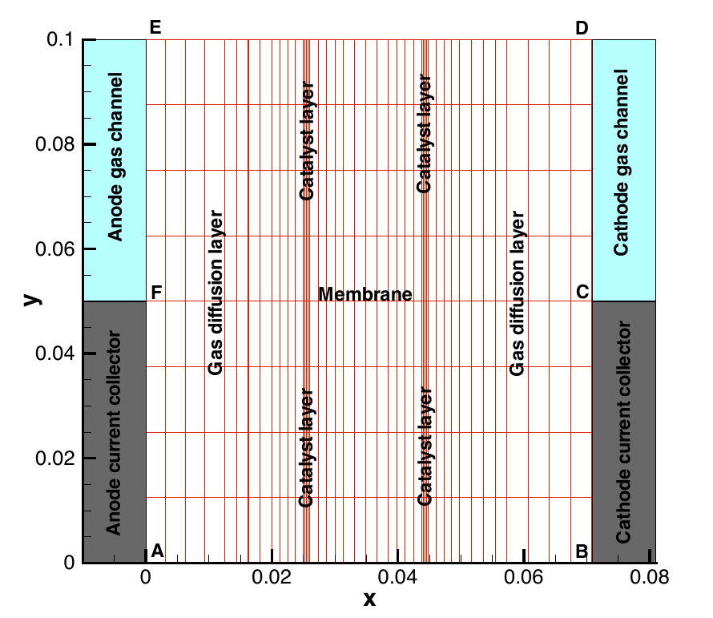

===========================
 Introduction to AppPemfc 
===========================

Introduction
============

This application simulates the complete Membrane Electrode Assembly (MEA) with a half channel-half landing geometry. A schematic of the geometry in 2D is shown below,

This application is an isothermal model of the MEA and can be used to analyze the performance of the MEA under specified operating conditions, generate a polarization curve as well as do optimization studies on the complete MEA. 
if temperature effects are important in the cell under consideration, then we advise to use the AppPemfcNIThermal which accounts for the temperature effects on the governing equations.

Governing equations
=================== 

The model is based on the following assumptions: 

  1. The fuel cell is at steady state and operates at constant temperature and pressure.
  2. The cathode is fed with humidified air.
  3. The anode is fed with humidified hydrogen.
  4. The gas diffusion layers are composed of a porous fibrous matrix.
  5. The catalyst layer is formed by agglomerates made of mixture of platinum supported on carbon and ionomer membrane electrolyte and surrounded by void space.
  6. The electochemical reaction occurs inside the agglomerates.
  7. The transport of reactants from the gas channels to the catalyst layer occurs only by diffusion of reactant gas to the agglomerate surface and then by dissolution and diffusion through the ionomer to the reaction site.
  8. The transport of water inside the electrolyte in the membrane and CL is modeled using Springer's model.
  9. The membrane and gas phase in the CL are assumed to be in equilibrium throughout the CL, therefore they are related by means of the sorption isotherm.
  10. The transport of protons takes place only through the electrolyte, i.e. the Nafion and it is governed by Ohm's law.
  11. The transport of electrons takes place only through the solid phase, i.e. the carbon fibers in the GDL and the mixture of carbon supported platinum in the catalyst layer, and is governed by Ohm's law.

The governing equations are

.. math::
  R_1(\vec{u}) = \nabla \cdot(c_gD^{eff}_{O_2} \nabla x_{O_2})  - S_{O_2} = 0
  
.. math::  
  R_2(\vec{u}) = \nabla \cdot(c_gD^{eff}_{w} \nabla x_{w})  - (S_{w} + S_{\lambda} ) = 0
  
.. math::
  R_3(\vec{u}) = \nabla \cdot(\sigma^{eff}_{m} \nabla \phi_m)  - S_{H^+} = 0
  
.. math::
  R_4(\vec{u}) = \nabla \cdot(\sigma^{eff}_{S} \nabla \phi_S)    - S_{e^-} = 0
  
.. math::
  R_5(\vec{u}) = \nabla \left( n_d \frac{\sigma_m}{F} \nabla \phi_m + \frac{\rho_{dry}}{EW} D_{\lambda} \nabla \lambda \right) +S_{\lambda} = 0

where the unknowns are the oxygen mole fraction, :math:`x_{O_2}`; the water mole fraction, :math:`x_w`; the electrolyte (membrane) and electronic potentials, :math:`\phi_m` and :math:`\phi_S` respectively; 
and, the membrane water content, :math:`\lambda`. The effective transport parameters :math:`D^{eff}_{O_2}`, :math:`D^{eff}_{w}`, :math:`\sigma^{eff}_{m}` and :math:`\sigma^{eff}_{S}` are different in the membrane, 
GDL and CL and depend nonlinearly on the design variables. Due to the solution methodology, all equations need to be solved in all the domains, i.e. GDL, CL and membrane. 
However, some equations are not necessary in some of the cell domains. This is addressed by making the unnecessary transport parameters almost zero. 
  
The source terms in the system of equations are given by

.. math::
  S_{O_2} = \left\{
  \begin{array}{cl}
  0 &\text{in anode CL, GDL and membrane} \\
  \frac{1}{4F}\nabla \cdot \vec{i} &\text{in CL}
  \end{array}
  \right.

.. math::
  S_{w} = \left\{
  \begin{array}{cl}
  0 &\text{in anode CL, GDL and membrane} \\
  -\frac{1}{2F}\nabla \cdot \vec{i} &\text{in cathode CL}
  \end{array}
  \right.

.. math::
  S_{H^+} = \left\{
  \begin{array}{cl}
  0 &\text{in GDL and membrane} \\
  \nabla \cdot \vec{i} &\text{in cathode CL} \\
  - \nabla \cdot \vec{i} &\text{in anode CL}
  \end{array}
  \right.
  
.. math::
  S_{e^-} = \left\{
  \begin{array}{cl}
  0 &\text{in GDL and membrane} \\
  -\nabla \cdot \vec{i} &\text{in cathode CL} \\
  \nabla \cdot \vec{i} &\text{in anode CL}
  \end{array}
  \right.
  
and

.. math::
  S_{\lambda} = \left\{
  \begin{array}{cl}
  0 &\text{in GDL and membrane} \\
  k\frac{\rho_{dry}}{EW}(\lambda_{eq} - \lambda) &\text{in both CLs}
  \end{array}
  \right.

where :math:`\lambda_{eq}` is given by the sorption isotherm reported by Hinatsu et al. at the corresponding water vapour activity value in the specific location in the CL. For a more detailed description
of the model see references Secanell08_ , Secanell10_ and Moore14_.

The same application can be used to solve problems with a variety of GDL, MPL and CL parameters, different kinetic models, and CL micro-structures (see reference Moore14_ ). Several examples below
illustrate how to run the application in order to solve the different cases.

Example Directory structure
=========================== 

The cathode directory consists of the following folders:

1. template : This folder contains the default files for running all the examples in the other folders. Please **do not** modify this file as 
it will result in all tests failing. If you would like to create your own example either include this file to your simulation using the *include*
command or copy the file to a different location. 

2. analysis : This folder contains the :code:`main_test.prm` and :code:`data_test.prm` files needed to run a simulation at a given cell voltage. 
Note the data file includes the template find and adds the necessary modifications.

Setting up a simulation
=======================

See AppCathode to learn how to setup a simulation with either the OpenFCST GUI or via text files.

.. toctree:: 
    
    
   homogeneous/readme.rst
   agglomerate/readme.rst

References
==========

.. _Secanell08:

M. Secanell, R. Songprakorp, A. Suleman and N. Djilali, "Multi-Objective Optimization of a Polymer Electrolyte Fuel Cell Membrane Electrode Assembly", Energy and Environmental Sciences, 1(3):378-388, 2008.

.. _Secanell10:

M. Secanell, R. Songprakorp, N. Djilali, A. Suleman, "Optimization of a proton exchange membrane fuel cell membrane electrode assembly". Structural and Multidisciplinary Optimization, 40(1-6) 563-583, 2010

.. _Moore14:
M. Moore, P. Wardlaw, P. Dobson, J.J. Boisvert, A. Putz, R.J. Spiteri, M. Secanell, "Understanding the Effect of Kinetic and Mass Transport Processes in Cathode Agglomerates", Journal of The Electrochemical Society, 161(8):E3125-E3137, 2014.
