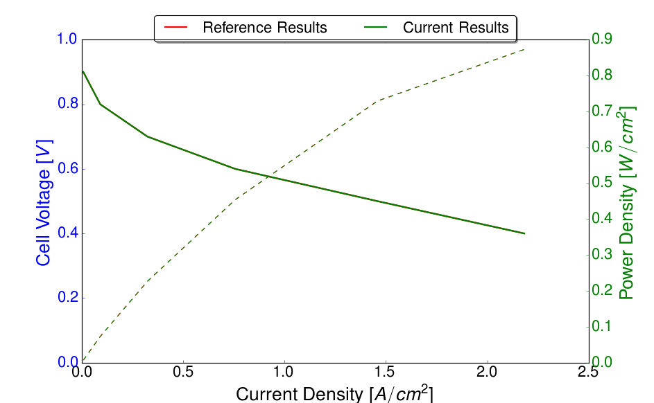

Example 1: A simple polarization curve 
======================================

This examples demonstrates the calculation of a polarization curve based on the
non-isothermal MEA model. This calculation is based on a default selection of
material properties described below. A regression test has been performed with three
adaptive refinement steps and hundred points on the polarization curve down to an
cell voltage of 0.01 Volts. The results of the run scripts are plotted against these
regression results.

**************************************************************
Simulation Setup
**************************************************************

The Data Files
###############

The *main.prm*, *data.prm* and *opt.prm* files are identical to the global template 
files, except for small modifications through the lexicographic replacer
sed executed by the run.sh file.

*****************************************************************
Simulation Execution
*****************************************************************

Main Simulation execution
#########################

Postprocessors
###############

The simulation produces a number of result files. The most important are:

 #. **logfile.log** - The main logfile, useful for debugging purposes
 #. **data_polcurve.dat** - The result file from the optimization. This can be used to generate polcruves, water crossover curves, voltage loss breakdowns and many more.
 #. **.vtu** files - VTK files which can be read with any recent viewer supporting vtk (e.g. Paraview, ViSIT, Mayavi2, ...). OpenFCST ships with a posprocessor to generate a correctly ordered collection file (**.pvd**)

*****************************************************************
Results
*****************************************************************

The Polarization Curve
#######################

   
   Generated polarization curve compared with reference
