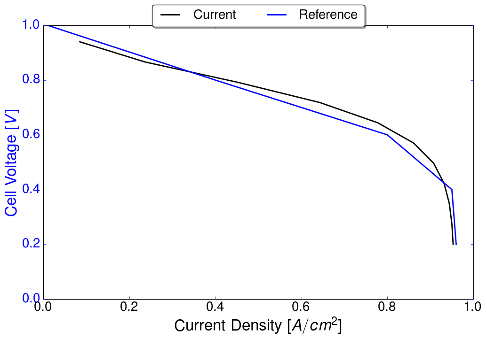

Example: Optimization of an agglomerate cathode electrode
==============================================================

This folder contains the files used in order to reproduce the results reported in reference Secanell07b_.

The data is subdivided as follows:

1. Directory ``template/`` contains the main main.prm, data.prm and opt.prm file used in the simulations. In each of the sub-folders these files are extended

2. Directory ``analysis/`` contains the data to run a single point in the polarization curve. It uses the data in ``template/`` directly without modifications.

3. Directory ``parameteric/`` contains the data files used to compute a full polarization curve. To achieve this goal, only the main.prm is modified with respect to the template files by including information about the number of points needed in the polarization curve. The directory also includes an .ods file used to compare the data. The results, as of Feb. 2, 2014, OpenFCST Rev: 1817 match the article.

4. Directory ``optimization/`` contains the main, data and optimization files necessary to run the optimization studies in section 4 of reference Secanell07b_.

**Warning:** This directory is not tested with regression tests, therefore it is possible that the parameter file has to be modified slightly in order to obtain the correct solution. The folder was last validated on Feb. 3, 2015
prior to openFCST release 0.2.

Polarization curve
------------------

The ``main.xml`` file
^^^^^^^^^^^^^^^^^^^^^

In order to perform a polarization curve, the same data file as for analysis case is used. The only difference in the *main.xml* file is specifying the polarization curve parameters, e.g.

Example:

.. include:: parametric/main.prm
    :literal: 

Results
^^^^^^^

Below is the polarization curve obtained from running the template file:
                                                                                                                                                                                 

.. command-output:: fuel_cell-2d.bin main.prm
    :cwd: ./parametric
    
To plot the polarization curves we use the plotting utility available in **PythonFCST** and compare the simulation results with the reference results.

.. command-output:: fcst_plot_polcurve.py polarization_curve.dat polarization_curve_reference.dat --label Current Reference --output article
    :cwd: ./parametric
    

Optimization study
------------------

In order to perform an optimization study, several changes are necessary in the main.prm (.xml) file. Also, a new file is need to provide information to the optimizer.

The ``main.xml`` file
^^^^^^^^^^^^^^^^^^^^^

The *main.xml* file needs to be modified as follows:

  1. In section *Simulator*, set *Analysis type* to Optimization
  2. In section *Simulator*, subsection *Optimization* specify the optimization file in *optimization parameter file name*
  
Example:

.. include:: optimization/main.prm
    :literal: 
    
The ``opt.xml`` file
^^^^^^^^^^^^^^^^^^^^

The *opt.xml* is used to specify the optimization number of design variables, and its initial value, upper and lower bounds. It also specifies the number of objectives and constraints and if they are equality or inequality
constraints. Finally, it specifies the type of optimizer to use. In the article case, the file is:

.. include:: optimization/opt.prm
    :literal:

