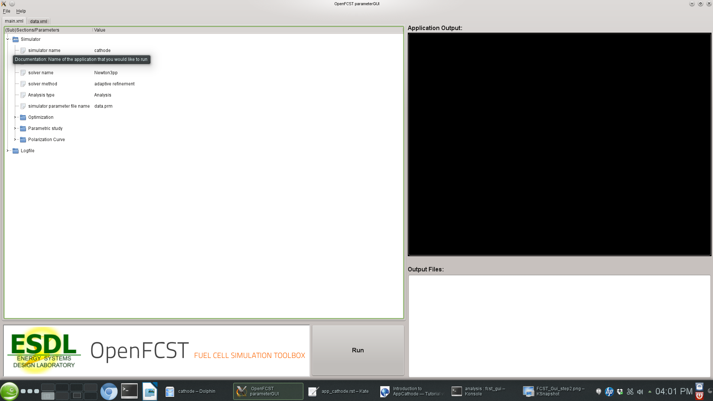
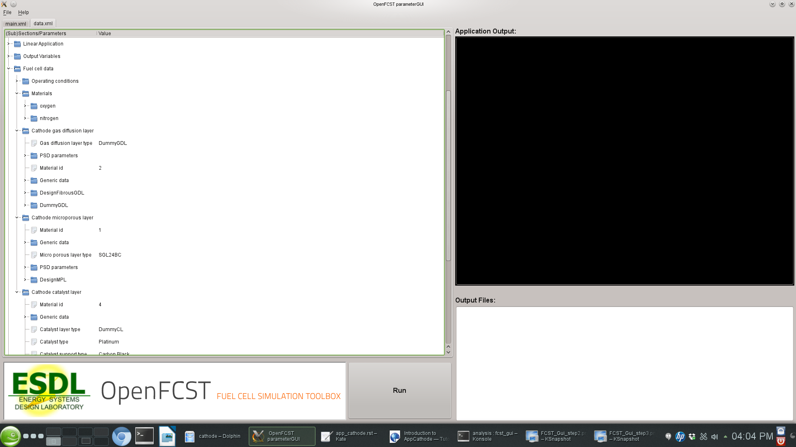

===========================
 Introduction to AppCathode 
===========================

Introduction
============

AppCathode is the simplest of the openFCST application. It is used to study mass and charge transport in a cathode electrode. Different catalyst layer models can be evaluated including:

    a. macro-homogeneous catalyst layer model
    
    b. agglomerate catalyst layer model.

Governing equations
===================

The governing equations are

.. math::
  R_1(\vec{u}) = \nabla \cdot (c_{total}D^{eff}_{O_2} \nabla x_{O_2} ) = \frac{1}{nF}\nabla\cdot i
.. math::  
  R_2(\vec{u}) = \nabla \cdot (\sigma^{eff}_{m}\nabla\phi_m) = \nabla \cdot i
.. math::
  R_3(\vec{u}) = \nabla \cdot (\sigma^{eff}_{s}\nabla\phi_s) = -\nabla \cdot i
  
where, for the case of a macro-homogeneous catalyst layer,

.. math::
  \nabla \cdot i = A_v i^{ref}_0 \left( \frac{c_{O_2}} {c^{ref}_{O_2}} \right) \mbox{exp} \left( \frac{\alpha F}{RT}(\phi_m - \phi_s) \right)
  
and for the case of the agglomerate, reference a below provides a more detailed formulation.

The solution variables are the protonic potential, :math:`\phi_m`, the electronic potential, :math:`\phi_s` and, instead of the oxygen concentration, 
we use the oxygen molar fraction, :math:`x_{O_2}`, that also accounts for the oxygen dissolving in the ionomer by using Henrys Law. 

The govering equations above are nonlinear and therefore they cannot be solved directly. In OpenFCST, we have decided to solve the system of equations 
using a nonlinear Newton solver. Therefore, instead of implemeting the equations above, a linearization of the governing equations above are solved, i.e.

.. math::
  \frac{\partial R_i(\vec{u^{n-1}})}{\partial u_j} u_j = R_i(\vec{u^{n-1}})
  
For more information on the governing equations, discretization and solution methodology please read Secanell07a_ and Secanell07b_.

Cathode Example Directory structure
=================================== 

The cathode directory consists of the following folders:

  1. *template* : This folder contains the default files for running all the examples in the other folders. Please **do not** modify this file as it will result in all tests failing. If you would like to create your own example either include this file to your simulation using the *include* command or copy the file to a different location. 

  2. *analysis*: This folder contains the `main.prm` and 'data.prm` files needed to run a single analysis. It is a good starting point to learn how to use OpenFCST.

  3. polarization_curve : This folder contains the `main_test.prm` and `data_test.prm` files needed to run a simulation to obtain a polarization curve. Note the data file includes the template find and adds the necessary modifications. The script to run a test to make sure the polarization curve is running correctly is in the folder *regression* together with the default data the test is compared to.

  4. optimization : This filder contains the :code:`main_test.prm` and :code:`data_test.prm` files needed to run a simulation with Dakota to obtain a polarization curve. The test is used to test the functionality of Dakota. The script to run a test to make sure the polarization curve is running correctly is in the folder *regression* together with the default data the test is compared to.

  5. parallel : This folder contains the :code:`main_test.prm` and :code:`data_test.prm` files needed to run a simulation in parallel. The script to run a test to make sure the polarization curve is  running correctly is in the folder *regression* together with the default data the test is compared to.

  6. Secanell_EA07_Numerical_Optimization_PEMFC_Cathode_Electrodes : This folder contains the data files needed to reproduce the results in reference Secanell07a_. A detailed description on how to use the files is given below.
 
  7. Secanell_EA07_MultiVariable_Optimization_PEMFC_Cathodes_Agglomerate_Model : This folder contains the data files needed to reproduce the results in reference Secanell07b_. It also serves as an example on how to setup a cathode catalyst layer with an agglomerate model.

  
Setting up a cathode simulation
===============================

In order to run OpenFCST, two files are needed that provide the necessary information for OpenFCST to execute:

  a. A main file: This file is used to select the appropriate: a) type of analysis, i.e. analysis, parametric study, polarization curve and optimization study; application; b) the nonlinear solver; c) data file name; and, d) several less critical parameters.

  b. A data file: This file is used to input all the input data used for the simulation for the application selected.

Both these files can either be loaded and modified via the openFCST graphical user interface (GUI) or modified as a text file. 

Setting up a simulation using the OpenFCST graphical user interface (GUI)
-------------------------------------------------------------------------

If you are using the OpenFCST GUI, you will need to load the .xml files. You can generate an .xml file from a .prm file by calling openFCST. There are two ways of calling OpenFCST:
   
  a. Calling the binary file in Install/bin directly by typing from ``Install/example/cathode`` folder: ``../../bin/fuel_cell-2d.bin`` 
  
  b. Sourcing a file with all the aliases for OpenFCST and then using the shortcut ``fcst2D`` and ``fcst3D``. The file to be sourced is in the main ``Install`` folder and is named ``fcst_env.sh``. To source it, please type the following in a new terminal ``source fcst_env.sh``.
  
Let's use the latter method to generate the .xml files as follows:
  
.. code::

    $ fcst2D -c main.prm
    
openFCST will directly parse the main.prm and the associated data and optimization files (if specified in the main.prm file).

If you would like to use the GUI, first launch the GUI by going to Install/bin and typing:

.. code::

    $ ./fcst-gui
    
Then, select the OpenFCST executable file that you would like the GUI to run, mainly openFCST-2d or openFCST-3d from the /Install/bin folder. Once
this has been selected, the following screen will appear

.. image:: figures/FCST_Gui_step1.png
   :scale: 50 %
   :alt: alternate text
   :align: center

At this point, you can load your main.xml and data.xml files. Go to ``File> Open Project...`` and select the ``main.xml`` and ``data.xml`` files. If you are planning on running an
optimization simulation, then also load the ``opt.xml`` file, otherwise select **No** to loading a new simulation.

Once ``main.xml`` and ``data.xml`` files are loaded, the following will appear in the GUI,

   
At this point, the GUI will show several folders in the ``main.xml`` and ``data.xml`` tabs. Each folder contains options that you can modify. 
You can open each folder by clicking on them in order to see the variables that can be modified in each subsection. If you hover over each variable with your mouse, 
a text window will appear explaining the use of each input parameter. 

The ``main.xml`` file
^^^^^^^^^^^^^^^^^^^^^

The ``main.xml`` file contains the following sections:

  1. *Simulator* : This section is used to select the type of analysis, the type of application, the non-linear solver and if adaptive refinement is needed.
  
  2. *Logfile* : This section is used to setup logging options.
  

The section **Simulator** contains the following parameters:

  1. *simulator name* : This parameter is used to select the application you would like to run. If you double-click on the name, a drop-down menu with all possible applications available will appear. Select the application you would like to run from the menu. In your case, select *cathode*. 
  
  2. *solver name* : This parameter is used to specify if the application you are solving is linear or nonlinear. If it is nonlinear several solvers are available. Please select one.
  
  3. *solver method* : This parameter is always set to *adaptive*. The *adaptive* option allows the user to use adaptive refinement and global refinement options so that the solution is refined during the solution.
  
  4. *Analysis type*: This parameter is used to specify if you would like to run at a single voltage, a full polarization curve, a parametric study or an optimization case. For now, we will set this value to *Analysis*. In the following sections, examples of how to use the other types are given.
  
  5. *simulator parameter file name* : This section is **very important**. The name specified here is the name of the ``data.xml`` file you would like to use. Make sure that it matches the second Tab in the GUI, otherwise OpenFCST will run a different datafile than the one that appears in the GUI.
  
  6. *simulator specifications* : This section is used only if a fluid flow application is used.
  
  7. Subsections *Optimization*, *Parametric Study*, and *Polarization Curve* are used to specify parameters that control those types of analysis and will be discussed later.

The ``data.xml`` file
^^^^^^^^^^^^^^^^^^^^^    

The simulation data is shown in the second tab in the GUI. If you started the GUI without any files, clicking next in the GUI would generate a defaul ``data.xml`` file.
If you are starting, it is **highly recommended** that you load the default files in the ``analysis`` folder.

If you have loaded the ``data.xml`` file , go to the next tab, i.e. data.xml. The following screen will appear:

   
In this screen, you can select the most suitable options to run your simulation. The most important folders are:

  1. *Grid Generation*: Specify the mesh you would like to use. You can either read a mesh from file (*Type of mesh*>*External mesh*) or have openFCST create the geometry. In this case we use *Cathode*. This will generate a mesh for a cathode containing a catalyst layer and a gas diffusion layer. The dimensions of these layers can be specified in the section *Internal mesh generator parameters*. In this section specify dimensions and the *Material ID* for the layers. This ID is used in section *Fuel Cell Data* to assign this section of the mesh the necessary properties.
  
  2. *Discretization*: This section is used to specify the type of finite element you would like to use. In this case we use *FESystem[FE_Q(1)^3]* which means that the three variables/equations -- a Bubnov-Galerkin method is used to discretize the equations -- that we solve for will be discretized using first order Lagrange finite elements. We could use second order by writing *FESystem[FE_Q(2)^3]*. We could also used mixed elements by writing *FESystem[FE_Q(1)^2-FE_Q(2)]*. In the later case, the first two variables/equations are discretized using first order Lagrange elements and the other equation using second order Lagrange elements.
  
  3. *System Management*: This section is used to specify to OpenFCST the number of equations that will be solved and the physics that are solved for each equation. The section `Solution variables` and the section `Equations` specifies the names of the equations. **Important: Do not touch this subsection as it is dependent on application used.**
  
  4. *Equations*: This section is used to specify all the necessary information to initialize each one of the equations selected in `System Management`. There is one section per equation. In each equation the following must be specified `Initial data`. The infomration here is used to create an initial solution for nonlinear problems. Provide a list of Material_ID:Value. The Value given will be used to initialize the solution in the section of the mesh with the given Material_ID. `Boundary data` is used to specify the Diritchlet boundary conditions for the problem.
  
  5. *Newton*: Specify the options for the Netwon solver (For nonlinear applications only).
  
  6. *Initial Solution*: This section is used to provide information on how to initialize the initial solution for nonlinear problems and to specify if the initial solution should be outputed to a file. OpenFCST allows users to run a simulation, store a solution and then use that solution as the initial solution of the next problem. To do so, first set *Output initial solution for transfer* to true. This will create a hidden file where the solutio is stored. Next, set *Read in initial solution from file*. Then, the previous solution will be read.
  
  7. `LinearApplication`: Specify the linear solver and options to solve the linearized problem.
  
  8. `Fuel cell data`: This is likely **the most important** section for an electrochemist. Here is where all the fuel cell parameters are specified. It is likely this is the only section you would like to modify extensively. This section contains several subsection which are used to select the cell operating conditions, and the parameters for each layer.This section is discussed further below.
  
  9. `Output`: This section is used to specify the output format for the mesh and the solution. If you want to visualize the solution with *Paraview*, then you should output the solution in *VTU* format.
  
*Fuel cell data* contains a section to specify the operating conditions and one per layer. In section `Operating conditions` the user can specify the cell voltage, temperature, gas inlet
conditions. Some of this conditions are Diritchlet boundary conditions. If the variable `Adjust initial solution and boundary conditions` is set to true, then the values in the 
`Equation` section will be overwritten. Note however, that the values in `Equation` are however necessary to setup the simulation.

Next are the sections to setup a layer. Let's take a look at section `Cathode catalyst layer`. All layer constain an entry `Material id`. This value has to match the value used in the 
mesh to identify the catalyst layer. Next, the parameter `Catalyst layer type` is used to select the catalyst layer that will be used. For each layer type, there is a section below
where all the parameters can be defined. Similarly to the layer, entries `Catalyst type`, `Catalyst support type`, `Electrolyte type` and `Kinetics type` can be used to select, from a
drop-down menu, the materials that we would like to use to create the layer. These properties are used, in the case of a ConventionalCL and MicroScale catalyst layer to 
estimate effective transport properties. For each selection, there are sections below that can be used to select parameters that are appropriate for the simulation.
Section `Generic Data` is used to specify permeability and other data common to all porous materials. Section `PSD parameters` is also used
to specify the pore-size distribution for the porous layer.
   
Once your parameters are set, simply press the **Run** button to launch the simulation. The ouput will be shown in the black screen to the right. The files in the directory also appear in the
bottom right corner. Configure *Paraview* to open the .vtu files to analyze the output.

Setting up a simulation using a text (.prm) file
------------------------------------------------

If instead of using the GUI, you would like to look at the files using a text editor, the .prm files are move convenient. As discussed, the **main.prm** file is the argument file supplied to the 
**OpenFCST** executable. The main.prm file should look like this:

.. include:: template/main.prm
    :literal: 
    
The data.prm file for the cathode example is shown below:

.. include:: template/data.prm
    :literal: 

The key disadvantage of using the .prm file is that for the parameters that have options, it is not possible to see the options that are available, therefore the use of the GUI is
strongly suggested for users.

Obtaining a polarization curve
==============================

.. include:: polarization_curve/readme.rst

.. include:: polarization_curve/main.prm
    :literal:

Once the `main.xml` or `.prm` file has been modified, run the simulation.

Additional Examples
====================

.. toctree::
    
   Secanell_EA07_Numerical_Optimization_PEMFC_Cathode_Electrodes/readme.rst
   Secanell_EA07_MultiVariable_Optimization_PEMFC_Cathodes_Agglomerate_Model/readme.rst
   

References
==========

.. _Secanell07a:
  
M. Secanell, B. Carnes, A. Suleman and N. Djilali, "Numerical Optimization of Proton Exchange Membrane Fuel Cell Cathode Electrodes", Electrochimica Acta, 52(7):2668-2682, 2007.

.. _Secanell07b:

M. Secanell, K. Karan, A. Suleman and N. Djilali, "Multi-Variable Optimization of PEMFC Cathodes using an Agglomerate Model", Electrochimica Acta, 52(22):6318-6337, 2007.