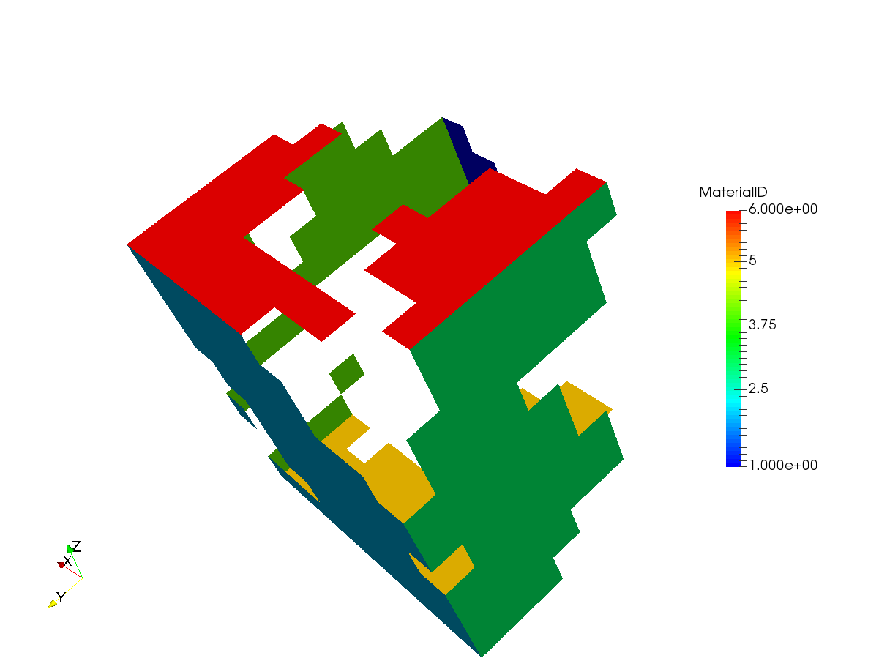
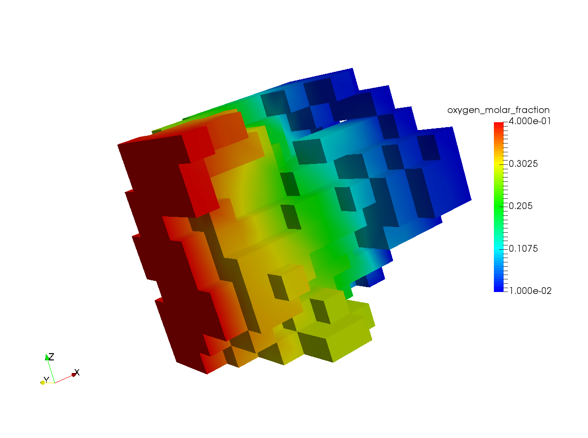
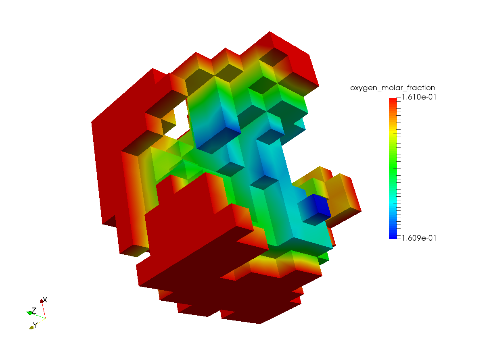

############################################################
Introduction to Microscale Simulations
############################################################

Microstructure simulations have been introduced in **OpenFCST release v0.3**. OpenFCST provides tools to generate meshes from image stacks and then perform diffusion, diffusion with reaction boundary condition and electron transport simulations on the generated meshes. **OpenFCST** uses a VTK mesh generator using the TVTK library [#]_. This example illustrates the different steps from generating a mesh from images to setting up and running simulations.

The steps covered in this tutorial are:

 #. Generating a VTK mesh using **PythonFCST** 
 #. Diffusion based simulation in **OpenFCST**
 #. Electron transport simulation in **OpenFCST**
 
 
**************************************************************
Generating a VTK mesh using **PythonFCST**
**************************************************************

In this example, we will demonstrate how to generate an Unstructured Grid mesh in the Legacy VTK format using the PythonFCST package (which are Python libraries to extend functionality of 
OpenFCST). This utility to generate a VTK mesh is beneficial when a mesh needs to be created from a stack of tiff images (such as those obtained from FIB-SEM, TEM, etc.) or from a 3D numpy array in Python.
There are two approaches that can be used which are described below

Using the Python executable **writeVTK.py**
############################################

PythonFCST comes equipped with a Python executable **writeVTK.py** which reads in a stack of tiff images and generates a Legacy Unstructured Grid file using the pixel values in the images as the material ids for the mesh.
Before running writeVTK.py it is important that OpenFCST is installed on the system and the OpenFCST environment variables are set using the 
**fcst_env.sh** file in the FCST Install Directory (${FCST_DIR}). To set the environment variables type the following command in the Terminal (or Konsole) from ${FCST_DIR}:

.. code::

    $ . fcst_env.sh

Once the environment variables have been set the writeVTK.py should be available as a command line utility. To ensure the environment variable has been set, the following command can be used:

.. code:: 

    $ writeVTK.py -h
    Usage: writeVTK.py [options]

    Options:
    -h, --help            show this help message and exit
    -f FILE, --file=FILE  relative path of the images to be converted
    -b BASENAME, --basename=BASENAME
                          basename of the image files. Default: 'Slice_'  would
                          mean images with name Slice_001 and so on
    -n NUM                Number of images to be read. Default: 200
    -o OUTPUT             Output file name. Default: test.vtk
    -m MATERIAL, --material=MATERIAL
                          material id of the phase to be meshed. Default: 0
    -v VOXEL, --voxel=VOXEL
                          voxel size as x y z
    -e EXTENSION, --extension=EXTENSION
                          extension for the input files. Default is .tiff
                        
The above command generates the help documentation for the writeVTK.py. In order to generate the mesh, the relative folder location from the current working directory for the images needs to be specified with the -f identifier. 
The basename of the images refers to the name of the image without the numerical part and extension. For example, for images named 'Slice_001.tiff' to 'Slice_100.tiff' the basename would be ``'Slice_'``. The number of images to be read in must be specified with the -n identifier. 
The output file name can be specified with the -o identifier. The voxel size which is the dimension in cm per pixel in the X,Y and Z direction is specified with the -v identifier. 
By default the extension for the images is '.tiff'. If the images have a different extension then they must be specified with the -e identifier. 
Another important option is the material id which can be specified with the -m option. The material  id represents the pixel value for which the mesh should be generated. The default material id is 0 which corresponds to the black color in a grey-scale image. 

For our example, we will generate a mesh from 10 images in the folder ${FCST_DIR}/examples/microscale/3D_Diffusion/images while the current working directory is ${FCST_DIR}/examples/microscale/3D_Diffusion, the following command is used:

.. code::

    $ writeVTK.py -f images/ -b Slice_ -n 10 -o my_test.vtk -m 0 -v 1e-6 1e-6 1e-6 -e .tiff

    ==================================================
    ==================================================
    =  Points and cells Created
    =  Writing a VTK file
    ==================================================
    Calculating Fitted Sphere Size Distribution 
    **************************************************
    = Processing dataset 
    --------------------------------------------------
    ==================================================
    = Calculate PSD
    =  - Pore radius 1e-06
    =  - Pore radius 1.1643739803e-06
    =  - Pore radius 1.32874796059e-06
    =  - Pore radius 1.49312194089e-06
    =  - Pore radius 1.65749592118e-06
    =  - Pore radius 1.82186990148e-06
    =  - Pore radius 1.98624388177e-06
    =  - Pore radius 2.15061786207e-06
    =  - Pore radius 2.31499184237e-06
    =  - Pore radius 2.47936582266e-06
    =  - Pore radius 2.64373980296e-06
    =  - Pore radius 2.80811378325e-06
    =  - Pore radius 2.97248776355e-06
    =  - Pore radius 3.13686174384e-06
    =  - Pore radius 3.30123572414e-06
    =  - Pore radius 3.46560970443e-06
    =  - Pore radius 3.62998368473e-06
    =  - Pore radius 3.79435766503e-06
    =  - Pore radius 3.95873164532e-06
    =  - Pore radius 4.12310562562e-06
    = The file has been successfully written!
    --------------------------------------------------
    Phase with material id: 0  is represented by material id 0 in the mesh file:  my_test.vtk
    time elapsed is  17.7439901829  seconds

If the command runs successfully, the above output will be displayed and the mesh file named **my_test.vtk** will be written to the ${FCST_DIR}/examples/microscale/3D_Diffusion (which was the current working directory). In addition to generating the mesh, the code also calculates the local radius based on a sphere fitting algorithm [#]_ of the phase and stores it in the generated mesh which will be later used in OpenFCST to account for the local Knudsen effects in the diffusion simulations.

Using the **MESH module in PythonFCST**
########################################

For people who are familiar with Python, using the **PythonFCST.mesh** module might be another option to generate the mesh. The mesh module contains the
Grid Generator class which generates the VTK mesh. The arguments to be supplied are a 3D numpy array (argument name: image) and the output filename (argument name: filename).
This provides a bit more flexibility to use any 3D numpy array which might have been generated from any source rather than being limited to a stack of tiff images.

For the purpose of this example, we would deal with the same set of images as above. Let's use the **PythonFCST.mesh** module to generate the mesh. The code snippet below describes how to use it for the example,

.. code:: python
    
    #Initial imports for libraries and modules
    
    import PythonFCST.mesh.PhaseGenerator as grid
    from PIL import Image
    import os
    import numpy as np
    
    #Defining variables to read in images; Omit this section if you already have a 3D array
    
    foldername = "images"
    basename = "Slice_"
    num_images = 10
    output = "my_test.vtk"
    name=os.getcwd()+'/'+foldername+'/'+basename+'%.3d'
    extension='.tiff'
    tmp = []
    
    #Looping over images and reading them
    for i in range(num_images):
      filename=name%(i+1)+extension
      tmp.append(np.asarray(Image.open(filename),dtype=np.float))
    
    #Generating the 3D numpy array
    image=np.dstack(tmp)
    image[image>0]=20 	#changing all non-zero material ids to 20; assuming that pixel value of 0 was the one of interest
    
    #Generating the VTK mesh using the Mesh module in PythonFCST
    o=grid(image,output,material=0)
    o.write()

The generated mesh file: my_test.vtk has the material id 0 from the grey scale images extracted. 

.. figure:: figures/pores.png
   :scale: 60 %
   :align: left
   
   Mesh of the pores represented by the black color (pixel value 0) in images
   

   
   Representation of the boundary ids [1-6] for the generated mesh
   
The mesh above shows the Knudsen radius of the pores computed and stored in the mesh. The boundary ids in the X, Y and Z direction are 1-2, 3-4 and 5-6 respectively. It is important to know these boundary ids because they will be used in the simulations.
   
.. note::
    
    VTK files invert the X and Y axis from the images. Therefore, if the image had dimensions 20 x 30 in X and Y direction respectively, then the mesh will have dimensions 30 x 20 in the X and Y direction. 
    By default, OpenFCST corrects for this so that the voxel sizes entered by user are in the **true** X and Y directions. 
    Also, the boundary ids are corrected so that 1-2 are boundary ids in the **true** X direction and in the Y direction for the mesh as seen above.

    The mesh can be further pre-processed using any of the filters in Paraview or Mayavi and could be written to a Legacy VTK file. This would still be compatible with the OpenFCST application. 
  
  
**************************************************************
Diffusion based simulation in **OpenFCST**
**************************************************************

Introduction
#############

Diffusion based simulations i.e, molecular diffusion, Knudsen diffusion and diffusion with reaction, are implemented in OpenFCST in the application **AppDiffusion**.
The application is used to simulate gas diffusion in a defined phase, i.e., pores in the microstructures, and can be used to compute the effective diffusivity of the porous media. In addition, the application can also be used to simulate oxygen diffusion with a reaction boundary condition and predict the electrochemical performance in the microstructure assuming that the overpotential losses are negligible.

Governing equation
###################

The governing equation for the application is based on Fick's Law and given by,

.. math::
  \bm{\nabla} \cdot (D_{O_2} c_{tot} \bm{\nabla} x_{O_2}) = 0 \quad \in \quad \Omega 

where :math:`D_{O_2}` is the oxygen diffusion coefficient, :math:`c_{tot}` is the total gas concentration (assumed constant), and :math:`x_{O_2}` is the molar fraction of oxygen which is also the solution variable for this application.

If Knudsen effects are not taken into account then :math:`D_{O_2}` is the binary diffusion coefficient of oxygen in air.

If Knudsen effects are to be taken into account then :math:`D_{O_2}` is modified to account for the Knudsen effects using the Bosanquet equation,

.. math::

    \frac{1}{D_{O_2}} = \frac{1}{D^{bulk}_{O_2}} + \frac{1}{D^{Kn}_{O_2}}
    
where :math:`D^{bulk}_{O_2}` is the molecular diffusion coefficient of the oxygen gas mixture (*which can be supplied by user or calculated using the Chapman-Enskog theory*) and :math:`D^{Kn}_{O_2}` is the Knudsen diffusion coefficient computed as follows,

.. math::

    D^{Kn}_{O_2} = \frac{2}{3} r_0 \sqrt{\frac{8RT}{\pi M_{O_2}}}
    
where :math:`r_0` is the local pore radius obtained using the pore size distribution algorithm (shown above), :math:`R` is the universal gas constant, :math:`T` is the temperature of the gas and :math:`M_{O_2}` is the molecular weight of oxygen.

.. note::
    
    :math:`D^{Kn}_{O_2}` is computed internally during execution based on the KnudsenRadius field supplied in the VTK mesh. Currently, only VTK meshes generated using the OpenFCST meshers are supported for accounting for local Knudsen effects in microstructures.
    
There are two sets of boundary conditions that can be used with AppDiffusion. The first set of boundary conditions are for the case of pure diffusion and given by,

.. math::

    x_{O_2} & = x_{O_2}^{in}\  \text{on}\ \Gamma_1, \\ 
    x_{O_2} & = x_{O_2}^{out}\  \text{on}\ \Gamma_2,\ \text{and}\ \\ 
    (D_{O_2} c_{tot}\bm{\nabla}x_{O_2}) \cdot \vec{n} & = 0 \ \text{everywhere else},
    
    
where :math:`\Gamma_1` is the inlet plane and :math:`\Gamma_2` is the outlet plane opposite to the inlet plane. The governing equation with these BCs are linear and therefore, can be solved using direct solvers such as UMFPACK, MUMPS or iterative solvers such as CG, GMRES.

The second of boundary conditions are for the case when reaction source terms are added to the oxygen diffusion. For this case the boundary conditions are as follows,

.. math::

    x_{O_2} & = x_{O_2}^{in}\  \quad \text{at all external walls}, \\ 
    (-D_{O_2}\bm{\nabla}c_{O_2}) \cdot \vec{n} & = \frac{j}{4F}A_{Pt,s|g} \quad \text{at}\ \Gamma_{s|g}.
    
where :math:`j` is the current density, :math:`A_{Pt,s|g}` is a ratio of the area of active platinum surface to the interfacial area between solid and pore and :math:`\Gamma_{s|g}` denotes the solid-pore interface.
For more details on the calculation of the source term please see [2]_. The boundary conditions and the governing equations form a non-linear system of equations which are linearized using Picard iterations and inner loops are solved using a linear solver such as MUMPS, UMFPACK or CG.

    
Setting up a diffusion simulation (with & without Knudsen effects)
##################################################################
    
Once we have the mesh generated using either the above method or any of the other methods, it is time to setup the simulation in OpenFCST. OpenFCST has the Fick's binary diffusion model implemented as the application diffusion. This can be used for simulating the flow through one of the phases in the 3D mesh that has been generated earlier. Before, running the simulation it is necessary that the environment variables are updated for the OpenFCST settings as described earlier. Once the environment is setup, we need to setup the parameter files for running the simulation. 

As a first example, we setup a simple diffusion simulation **without Knudsen effects**. This example is contained in the folder ${FCST_DIR}/examples/microscale/3D_Diffusion
For this the first file is the **main.prm** which is the argument file supplied to the OpenFCST executable. The main.prm file should look like this:

.. include:: 3D_Diffusion/main.prm
    :literal: 

The **main.prm** sets up the overall simulation. The parameters that need to be specified for this tutorial are the simulator name, to *diffusion*,
and the type of solver, to *Linear*. Since the Fick's binary diffusion model results in a linear system of equations it does not require the use of non-linear solvers.
In addition we specify the simulator parameter file to **data.prm** which specifies the necesssary parameters required to carry out the simulation. 
The **data.prm** looks like this:

.. include:: template/data.prm
    :literal:

The **data.prm** comprises of several important parameters which can be modified to affect the simulation. 
The first section is the **Grid generation** where the *Type of mesh* needs to be specified as 
*GridExternal* because we are supplying a user-defined mesh and also, the 
*File name  & File type* are specified based on the mesh generated earlier.

The next section is the **Adaptive refinement** where the option can be set for number of refinements in the solution as well as the various file output options can be changed.

The next section is **System management** where information with respect to the equations and solution variables is provided. For the Fick's diffusion model, we will just have one solution variable. 
However, the gas to be simulated can be modified by changing the name of the solution variable and the equation. For list of gases that can be simulated refer to *PureGas.cc*. 
For our example, we use a oxygen diffusion in nitrogen (default) which is specified as the solution variable and equation.

**Equations** section allows to input the initial and boundary conditions for the model. Although for the diffusion model the initial data is not necessary but it could be supplied just to ensure that the mesh is being read in correctly and appropriate phase is being solved for.
For this example, we apply Dirichlet boundary conditions on the Boundary ids 1 and 2. 

**Discretization** section allows flexibility to change the Finite Element system to be used.

**Fuel cell data** section is required to set the operating conditions.

**Cathode gas diffusion layer** is an important section as it determines how the mesh would be treated. We impose that the mesh being imported is a GDL and that the material id 0 is the phase of interest (on which the equation will be solved).
There are options to choose from the different *Gas diffusion layer type* which would define different values of diffusivity for the simulation from the 
OpenFCST database. For our example, we specify a *DummyGDL* with a diffusion coefficient of 0.22 :math:`cm^2/s`.

The next section is **Output Variables** which is used to specify if the boundary flux is to be computed. By default, the boundary flux is computed on Boundary id 2 for the solution variable which is the molar fraction of oxygen in this case.
The final section is **Output** where the output formats for the solution file can be specified. In addition, to the VTK files, the solver also outputs the solution as .dat file which contains the solution at the nodal points.

Once the two parameter files have been setup, they should be placed into the same folder as the VTK mesh file (${FCST_DIR}/examples/microscale/3D_Diffusion) and the following command can be used to run the simulation:

.. code:: 

    $ fuel_cell-3d.bin main.prm

If the simulation runs successfully, the solution files called "fuel_cell_solution_DataFile_00001_Cycle_*.vtu" would be written in the same folder.
These files can be viewed using **Paraview** for further postprocessing. The figure below shows a screenshot of the result,

   
   Oxygen molar fraction profile in the mesh after diffusion simulation

Additionally, the oxygen molar flux is also computed and printed to the shell as,

.. code::

    Response oxygen_molar_fraction is : 3.68304e-12
    
This is an important piece of information as it can be used to compute the effective diffusivity of the media using the following relation:

.. math::
    D^{eff}_{O_2} = J_{O_2}\frac{L}{A(C^{in}_{O_2}-C^{out}_{O_2})}

where :math:`J_{O_2}` is the flux output as shown above, :math:`L` is the diffusion length along the concentration gradient :math:`C^{in}_{O_2}-C^{out}_{O_2}` and :math:`A` is the cross-section area.

    
Now, to setup a simulation **with Knudsen effects** using the local pore radius (as described in the previous section), we have to make some modifications to the **main.prm** file. In order to include Knudsen effects an additional option called **simulator specification = knudsen** must be specified. The modified main.prm file is shown below,

    
.. include:: 3D_Diffusion/main_with_knudsen.prm
    :literal: 

The data.prm file remains the same as above because computation of the Knudsen effects is done internally and no modifications are required from the user in the data.prm file.

In order to run a simulation with Knudsen, the following command can be executed from the command prompt in the working directory ${FCST_DIR}/examples/microscale/3D_Diffusion

.. code::
    
    $ fuel_cell-3d.bin main_with_knudsen.prm

    
Once the simulation runs through the oxygen molar flux at the outlet will be calculated and printed to the shell. 

.. code::

    Response oxygen_molar_fraction is : 7.23639e-13
    
.. note:: 

    The oxygen flux at the outlet has decreased due to the additional Knudsen resistance introduced in the simulation.

    
Setting up a diffusion simulation with reaction boundary condition
###################################################################

The reaction boundary condition described earlier can be used to simulate oxygen diffusion in a microstructure with reaction at the solid-pore interface. A thin fictitious ionomer film is introduced to account for local losses. Details of the model can be found in [2]_.

The main.prm file for this case looks as follows,

.. include:: Diffusion_with_reaction/main.prm
    :literal: 
        
The **simulator specification = reaction** for this case. This will simulate the reaction BC without Knudsen effects. Additionally, the simulator specification can be changed to 
**reaction_and_knudsen** (as shown in the comment) which would simulate the reaction BC and take into account the local Knudsen effects.
As described earlier, that this is a non-linear problem therefore, a non-linear solver must be selected. The option **nonlinear solver name = Picard** specifies the use of Picard iterations.

Several changes need to be made to the data.prm file to setup the additional parameters for the simulation. The updated data.prm file looks as follows,

.. include:: Diffusion_with_reaction/data.prm
    :literal:
    

The first line in the data.prm includes the template. Therefore, all the parameters presented in the previous section are included and then only the parameters which are required for this example are changed.
Since the reaction occurs at the solid-pore boundary and the reaction term is a boundary flux *Boundary fluxes* parameter in the **Discretization** section is set to *true*.

As defined in the main.prm the Picard solver is used to solve the non-linear problem. The section **Picard** in the parameter file defines some of parameters for under-relaxation and convergence tolerance for the solution variable. 

The most important section is the **Equations->Ficks Transport Equation - oxygen** where the necessary parameters for the reaction boundary condition need to be defined.
The **Initial data** subsection is important for this problem because it is a non-linear problem so a good initial guess is important for the solution. The *set oxygen_molar_fraction = 0:0.1* sets the initial oxygen molar fraction in material id 0 which is the pore space for the mesh to 0.1.
The **Boundary data** subsection has two entries. The *set oxygen_molar_fraction = 1: 0.161, 2: 0.161, 3: 0.161, 4: 0.161, 5: 0.161, 6: 0.161* sets the oxygen molar fraction boundary condition on the boundary ids 1-6. The *set species_flux = 0:1* sets boundary id 0 (which is the boundary id for the solid-pore interface; default value by deal.II) as the boundary where the reaction flux is applied.
**Reaction data** section sets the electronic and protonic potentials for the simulations. The kinetics method is for computation of the current density is selected as *DoubleTrapKinetics* which is a multi-step model for the oxygen reduction reaction (ORR). *Ionomer dissolution constant* and *Ionomer film thickness* define the fictitious ionomer properties at the interface and *A_Pt,s|g* is the ratio of active area of platinum to the interface area of the solid-void interface.

**Output Variables** section is modified partially to change the *Output boundary id* to *0* because we want the flux of oxygen reacting at the solid-pore interface as the output to compute the total current from the simulations.

With these paramters when the simulation is run the output response is,

.. code::

    Response oxygen_molar_fraction is : 1.57756e-14

This translates to a total current of 6.08e-9 A using Faraday's Law. The figure below shows the oxygen profile screenshot from the simulation,        

        

   
   Oxygen molar fraction profile in the mesh after diffusion with reaction simulation

Additional examples
####################

More examples for the microstructures and simulation results reported in Sabharwal et al. [2]_ are provided in the folder ${FCST_DIR}/examples/microscale/Sabharwal_Analysis_of_FC_CL_2016/.
The folder contains two folders namely, Diffusion and Reaction. 

Diffusion folder contains the parameter files to simulate the diffusion with and without Knudsen effects and is similar to the example above. The meshes for Stack 1 and Stack 2 from [2]_ can be downloaded from the `OpenFCST website <http://www.openfcst.mece.ualberta.ca/download.html>`_.

Reaction folder contains the parameter files used for the section 3.3.1 for the publication [2]_. In order to run the entire polarization curve the variable **Equations->Ficks Transport Equation - oxygen->Reaction data->Electronic potential** should be varied from 0.9-0.25 V and the output can be converted to the current density using the data provided in [2]_. The mesh used for section 3.3.1 titled *Mesh1.vtk* can be downloaded from the `OpenFCST website <http://www.openfcst.mece.ualberta.ca/download.html>`_.

   
**************************************************************
Electron transport simulation in **OpenFCST**
**************************************************************

Similar to the diffusion application electron transport can be simulated in the solid-phase of the microstructures using OpenFCST application **AppOhmic**. Please check the AppOhmic documentation and examples page for more information on running those simulations.

    
.. rubric:: References

.. [#] P. Ramachandran and G. Varoquaux, *Computing in Science & Engineering*, 2011, 13, 40–51.
.. [#] M. Sabharwal, L. M. Pant, A. Putz, D. Susac, J. Jankovic and M. Secanell, *Fuel Cells*, 2016
