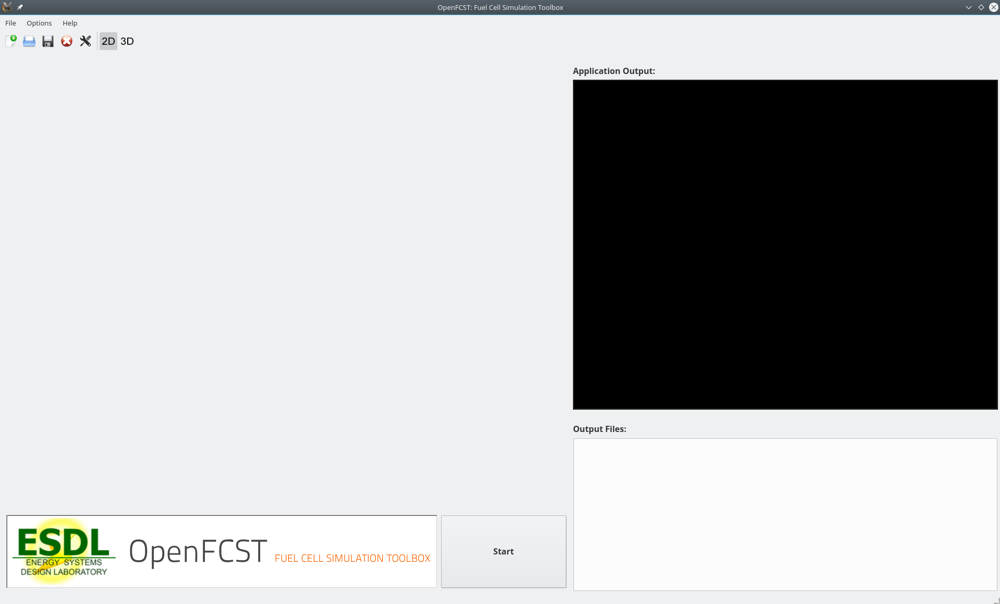
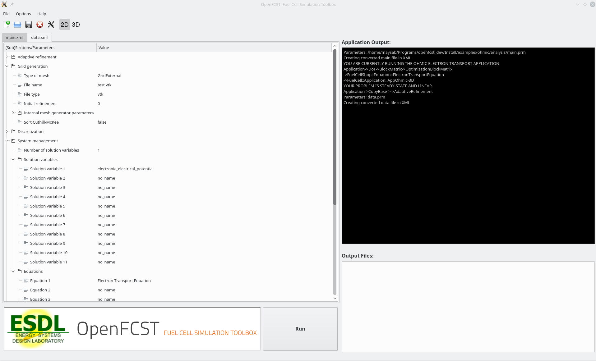

===========================
 Introduction to AppOhmic 
===========================

Introduction
============

AppOhmic is an openFCST application which is used to study the electron transport in porous media. The electron transport governed by Ohm's law is solved in the phase of interest using the FEM formulation of the weak-form of the equation.
The application returns the total electronic flux (current) at the outlet face which can then be used to the calculate the effective conductivity of the media.

Governing equation
===================

The governing equation is

.. math::
  \nabla \cdot \left( \hat{\sigma}_{s} \cdot \mathbf{\nabla} \phi_s \right) = 0 \quad \in \quad \Omega 

  
The governing equation in the weak form is linear and can be solved directly using a linear solver like UMFPACK or GMRES.

The solution variable is the electronic potential, :math:`\phi_s`.

Ohmic Example Directory structure
=================================== 

The ohmic directory consists of the following folders:

1. template : This folder contains the default files for running all the examples in the other folders. Please **do not** modify this file as 
it will result in all tests failing. If you would like to create your own example either include this file to your simulation using the *include*
command or copy the file to a different location. 

2. analysis : This folder contains the :code:`main_test.prm` and :code:`data_test.prm` files needed to run a simulation to obtain
the electronic potential distribution in the porous media. Note the data file includes the template find and adds the necessary modifications.
The script to run a test to make sure that the application and the equation class is running correctly is in the folder *regression* together with the default data the test is compared to.

Setting up an ohmic simulation
===============================

In order to run OpenFCST, two files are needed that provide the necessary information for OpenFCST to execute:
a. A main file: This file is used to select the appropriate: a) application; 
b) problem definition: (linear in this case); c) data file name; and, d) several less critical parameters.
b. A data file: This file is used to input all the input data used for the simulation for the application selected.

Both these files can either be loaded and modified via the openFCST graphical user interface (GUI) or modified as a text file. 

Setting up a simulation using the OpenFCST graphical user interface (GUI)
-------------------------------------------------------------------------

If you are using the OpenFCST GUI, you will need to load the .xml files. You can generate an .xml file from a .prm file by calling openFCST as follows:
  
.. code::

    $ openFCST-3d -c main.prm
    
openFCST will directly parse the main.prm and the associated data and file (if specified in the main.prm file).

If you would like to use the GUI, first launch the GUI by going to Install/bin and typing:

.. code::

    $ ./fcst-gui
    
Then, select the OpenFCST executable file that you would like the GUI to run, mainly openFCST-2d or openFCST-3d from the /Install/bin folder. Once
this has been selected, the following screen will appear

At this point, you can load your main.xml and data.xml files. Go to ``File> Open Project...`` and select the ``main.xml`` and ``data.xml`` files. If you are planning on running an
optimization simulation, then also load the ``opt.xml`` file, otherwise select **No** to loading a new simulation.

Once ``main.xml`` and ``data.xml`` files are loaded, the following will appear in the GUI,

.. image:: figures/FCST_Gui_step2.png
   :scale: 50 %
   :alt: alternate text
   :align: center
   
At this point, you have several folders. Each folder contains options that you can modify. You can open each folder and, by hovering over the variable with your mouse, 
a text window will appear that explains the use of each input parameter. In our case, *simulation name* specifies that you are going to run *AppOhmic*. *Simulator specification*
is only used for fluid applications, so it is not used here. *Solver name* specifies if the problem is linear or nonlinear and in the case of a nonlinear problem,
the nonlinear solver to be used is selected. *Solver method* allows the user to use adaptive refinement and global refinement options so that the solution is refined
during the solution. Analysis type is used to specify if you would simply like to run one simulation, obtain a polarization curve, perform a parameteric study or run
an optimization study.  For this application only the analysis mode is available.

To modify simulation data, go to the next tab, i.e. data.xml. The following screen will appear:

   
In this screen, you can select the most suitable options to run your simulation. The most important folders are:
a. Grid Generation: Specify the mesh you would like to use. You can either read a mesh from file (Type of mesh>External mesh) or have openFCST create the geometry. In this case we use cathode.
b. LinearApplication: Specify the linear solver and options to solve the linearized problem.
c. Equations: Specify the equations you would like to solve, the initial solution and boundary condition values.
d. Fuel Cell Data: Specify the layer properties.
e. Output
   
Once your parameters are set, simply press the **Run** button to launch the simulation. The ouput will be shown in the black screen to the right. The files in the directory also appear in the
bottom right corner. Configure *Paraview* to open the .vtu files to analyze the output.

Setting up a simulation using a text (.prm) file
------------------------------------------------

If instead of using the GUI, you would like to look at the files using a text editor, the .prm files are move convenient. As discussed, the **main.prm** file is the argument file supplied to the 
**OpenFCST** executable. The main.prm file should look like this:

.. include:: template/main.prm
    :literal: 
    
The data.prm file for the cathode example is shown below:

.. include:: template/data.prm
    :literal: 

The key disadvantage of using the .prm file is that for the parameters that have options, it is not possible to see the option that are available, therefore the use of the GUI is
strongly suggested for users.
